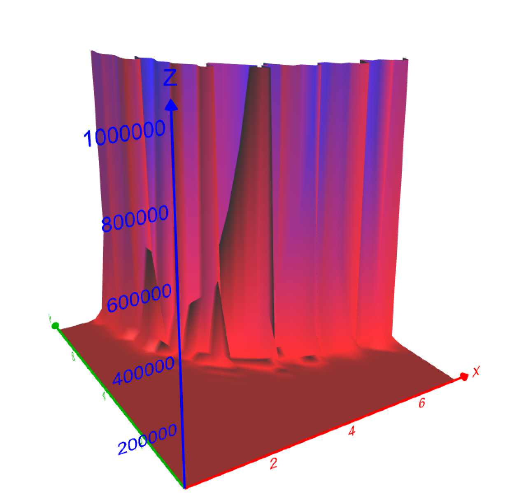

In this article, we'll talk through why concurrent programs are hard to reason about? And why is it so hard to tame their complexity.

State space explosion is one of the key sources of complexity in concurrent programs. The number of distinct interleavings increase dramatically and faster than most people intuitively appreciate. Let's try and build that intuition through a small example.

# All possible interleavings of a small program

To illustrate the point, consider the following example.

```csharp

public Task Greetings(string name)
{
  return Task.Run(() =>
  {
    Console.WriteLine($"Hello {name}");
    Console.WriteLine($"See you later, {name}");
  });
  
}

public async Task Test()
{
  var task1 = Greetings("Foo");
  var task2 = Greetings("Bar");

  await Task.WhenAll(task1, task2);
}

```

Can you enumerate the number of distinct possible outputs on the screen?

<details>
<summary>Click to reveal the solution</summary>

There are 6 possible distinct interleavings of the above program.

```
Hello Foo
Hello Bar
See you later, Foo 
See you later, Bar
 
Hello Foo
Hello Bar
See you later, Bar
See you later, Foo 
 
Hello Foo
See you later, Foo 
Hello Bar
See you later, Bar
 
Hello Bar
Hello Foo
See you later, Bar
See you later, Foo 
 
Hello Bar
Hello Foo
See you later, Foo 
See you later, Bar

Hello Bar
See you later, Bar
Hello Foo
See you later, Foo 
```

Were you able to think through all the above cases?

</details>

# Increasing the number of tasks

What if changed the above program to now have three tasks racing with each other instead of two.

```csharp

public Task Greetings(string name)
{
  return Task.Run(() =>
  {
    Console.WriteLine($"Hello {name}");
    Console.WriteLine($"See you later, {name}");
  });
  
}

public async Task Test()
{
  var task1 = Greetings("Foo");
  var task2 = Greetings("Bar");
  var task2 = Greetings("Baz");

  await Task.WhenAll(task1, task2, task3);
}

```
Can you now think of the number of possible outputs? Think hard before revealing the solution below.

<details>
<summary>Click to reveal the solution</summary>

There are 90 possible distinct interleavings of the above program. Yes. 90.

Did this come as a surprise?

</details>

# Size of state space with _n_ tasks and _m_ steps

If there `n` tasks and each task emits `m` statements on the screen, can you come up with a formula which describes the number of distinct possible interleavings?

<details>
<summary>Click to reveal the formula</summary>

If n = num tasks, and m = num steps, then there are **((m * n)! / m!^n)** distinct interleavings!

Let's try to understand the growth of the above function.

If we keep the number of tasks fixed at 2, and keep the number of steps variable, we get the following table.

| m (num steps) | interleavings |
|---------------|---------------|
| 1             | 2             |
| 2             | 6             |
| 3             | 20            |
| 4             | 70            |
| 5             | 252           |
| 6             | 924           |
| 7             | 3432          |
| 8             | 12870         |

The above table sure qualifies as an explosion as it rises exponentially even for moderate increase of number of steps.

Let's see the growth if we keep the number of steps fixed at 2 and vary the number of tasks instead.

| n (num tasks) | interleavings |
|---------------|---------------|
| 1             | 1             |
| 2             | 6             |
| 3             | 90            |
| 4             | 2520          |
| 5             | 113400        |
| 6             | 7484400       |
| 7             | 681080400     |
| 8             | 81729648000   |

The growth in interleavings as we grow the number of tasks grows that much more faster. With 8 tasks and 2 steps in each task, we have about 8 billion possible interleavings.

Here is a 3D plot of the growth in interleavings as a function of number of tasks (y-axis) and number of steps (z-axis)



As you can visually see, the number of interleavings soon increase _extremely_ rapidly as x and y increase.

</details>

# How can we tame this complexity?

The increase in the number of possible interleavings with number of tasks and number of steps is definitely a sobering realization. How can structure our programs and tests to prevent concurrency bugs in the face of this complexity?

Here are a few helpful suggestions.

## Test invariants instead of doing case-analysis

Developers often write test cases by thinking through "edge cases" and then write a test for each such edge case. While that technique works well for "sequential" tests and programs, it quickly breaks down in the presence of concurrency. And you shouldn't fault yourself for it. It's not humanly possible to think through thousands (or billions!) of interleavings.

It's much more effective to instead write "invariants" - statements which _must_ be true no matter which interleaving executed.

An effective technique when writing concurrency tests using Coyote is to trigger a bunch of tasks, let Coyote explore the many interleavings between them and write as many and as strong as possible assertions which _must_ be true in any possible interleaving in this test case. Some assertions are explicit, such as testing that the account balance of a user must never go negative, while others are implicit such as there should be no uncaught exceptions in any interleaving explored by Coyote.

## Test with the minimum number of tasks required to trigger a bug

The number of interleavings grow _much_ faster as the number of tasks grow compared to keeping the number of tasks low and just increasing teh number of steps. They grow fast in both cases but the growth rate is definitely much higher in number of tasks than it is in number of steps.

It's interesting to realize that most concurrency bugs can be triggered by just two tasks, usually three at max in most cases. Developers are used to writing stress tests to weed out such concurrency and 'non-deterministic' bugs as they typically don't have other tools to trigger such races. Stress testing often involves firing off a large number of tasks in hopes of triggering a race condition which leads to the bug. We earlier saw that the number of possible interleavings and the size of the state space increases very fast as the number of tasks grow which dramatically increases the size of the state space. Effective Coyote require us to do exactly the opposite where we should only spawn the _minimum_ number of tasks required to trigger the bug so Coyote can then explore the interleaving state space to find a race condition to trigger the bug.

## Minimize number of _steps_ by making each step larger

We saw how the number of interleavings grow as number of steps increase and we got a fairly large state space with just 7 or 8 steps. How can we hope to scale concurrency testing to large production concurrent programs with this kind of growth?

One realization to keep in mind is that we don't have to test _all_ possible interleavings of concurrent programs. Coyote executes sizable chunks of programs atomically and only explores interleavings around scheduling points such as `Task.Run`, `Task.Yield`, `Task.Delay`, `lock` statements and `Task.ExploreContextSwitch` statements. This helps it scale to much larger real-world programs than it otherwise would have been able to. And as the discussion in [this](https://github.com) shows, this doesn't always lead to  to reduced coverage as we only need to test interleavings around reads and writes to shared state, whether external or local.

The second realization to keep in mind is that Coyote comes with a number of different schedling strategies, from random searching to reinforcement learning based strategies and more. While you should keep the size of the state space in mind, you shouldn't despair as Coyote can be fairly effective at finding concurrency bugs. You'll be surprised to learn that there are a ton of _shallow_ concurrency bugs which are often missed by developers but Coyote doesn't have a hard time finding them due to their shallow nature.
